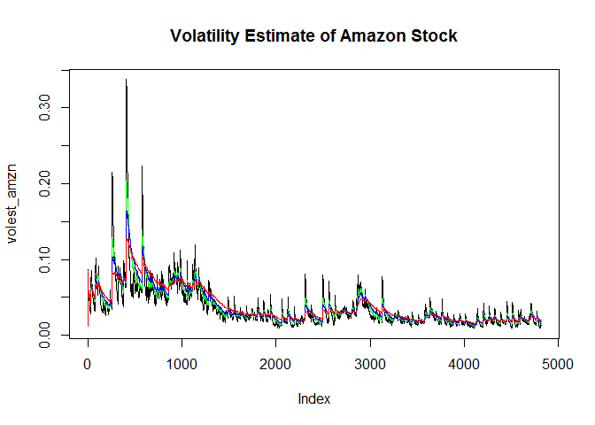

# Unit9.5 Volatility Measure
Vishal A  
July 6, 2016  
### Purpose: Download Amazon historic stock closing prices since it started trading and calculate volatility measure for the same.


```r
#As a first step we will load library TSERIES
library(tseries)
#download the data for amazon stock
AMZN <- get.hist.quote('amzn', quote="Close")
```

```
## Warning in download.file(url, destfile, method = method, quiet = quiet):
## downloaded length 310661 != reported length 200
```

```
## time series starts 1997-05-16
```

```r
#check length of dataset
length(AMZN)
```

```
## [1] 4816
```

```r
#Calculate log returns for Amazon stock for entire series.
AMZNret <- log(lag(AMZN)) - log(AMZN)

#Calculate amazon volatility measure
AMZNvol <- sd(AMZNret) * sqrt(250) *100

# Define Vol function that will be used to calculate volatility.

Vol <- function (d, logrets) {
	# Define variables used to calculate volatility.
  var=0
	lam=0
	varlist <- c()
	
	# Run a for loop on input returns to calculate volatility.
	for (r in logrets) {
		lam = lam*(1 - 1/d) + 1
		var =	(1-1/lam)*var + (1/lam)*r^2
		varlist <- c(varlist, var)
	}
	
	# Take a square root of varlist.
	sqrt(varlist) 
	
}


# Now calculate volatility for entire series for different weights.
# First weight

volest_amzn <- Vol(10, AMZNret) # Decay factor 90
volest1_amzn <- Vol(30, AMZNret) # decay factor 97
volest2_amzn <- Vol(50, AMZNret) # Decay factor 98
volest3_amzn <- Vol(100, AMZNret) # Decay factor 99

#Plot volatility estimate for Amazon.

plot(volest_amzn, type="l", main="Volatility Estimate of Amazon Stock")

lines(volest1_amzn, type="l", col="red")
lines(volest2_amzn, type="l", col="blue")
lines(volest3_amzn, type="l", col="yellow")
lines(volest3_amzn, type="l", col="green")
```

<!-- -->
